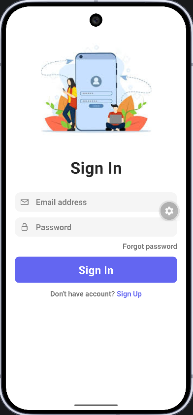
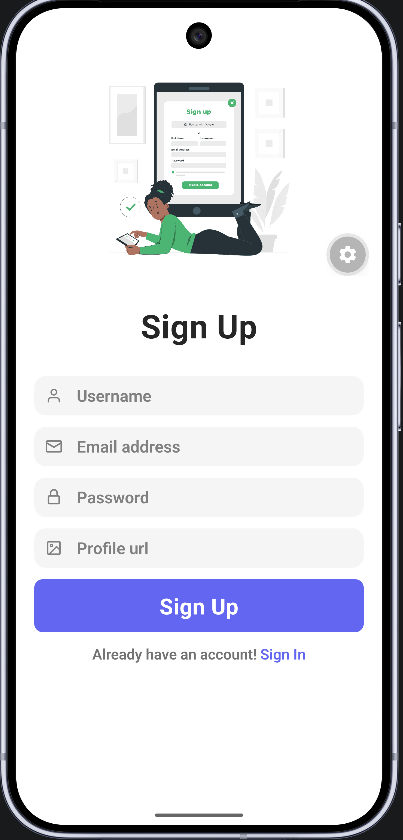
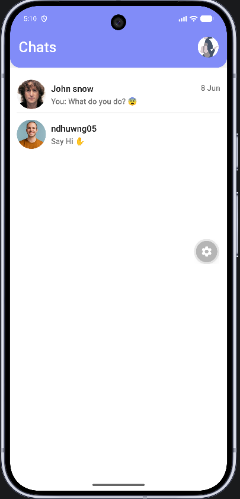
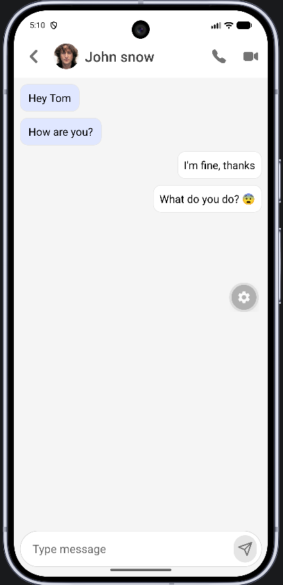
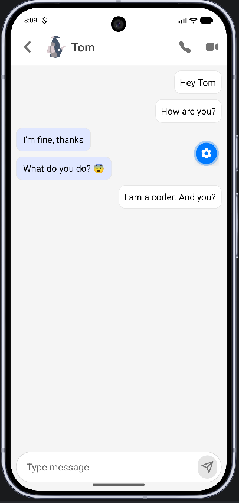

# Firebase Chat 💬


> **A cross-platform real-time chat app** — connect users through instant 1-on-1 messaging, built with **Expo + React Native** and **Firebase**.

---

## 📖 About

**Firebase Chat** is a modern mobile messaging app that enables fast communication between registered users. It supports **sign up / sign in**, a **conversation list**, and **1-on-1 chat rooms** with real-time message sync powered by **Cloud Firestore**.

> *No custom backend required — Firebase Auth and Firestore handle authentication, storage, and data synchronization.*

---

## 📸 Demo / Screenshots

### Authentication

<p align="center">
  
  
</p>

<p align="center">
  <em><strong>Sign In</strong> — Email & password with a clean, minimal UI &nbsp;|&nbsp; <strong>Sign Up</strong> — Create an account with username & profile photo URL</em>
</p>

### Chat List & Chat Room

<p align="center">
  
</p>

<p align="center">
  <em><strong>Home</strong> — Shows all users, last message preview, and timestamps updated in real time</em>
</p>

<p align="center">
  
  
</p>

<p align="center">
  <em><strong>1-on-1 Chat Room</strong> — Distinct sent/received message bubbles, auto-scroll & keyboard support</em>
</p>

---

## ✨ Key Features

- 🔐 **Email/Password Authentication** — Sign up, sign in, and sign out via Firebase Authentication with AsyncStorage persistence
- 👤 **User Profiles** — Store `username`, `profileUrl`, and `userId` in the Firestore `users` collection
- 💬 **Real-time 1-on-1 Chat** — Messages sync instantly via Firestore `onSnapshot` — no manual refresh needed
- 🏠 **Conversation List** — Display all users (except yourself) with last message preview and timestamp
- 🔑 **Smart Room IDs** — Automatically create a unique chat room by sorting and joining two users' `userId` values
- 🎨 **Modern UI** — Styled with NativeWind (Tailwind CSS) and responsive layout via `react-native-responsive-screen`
- 🖼️ **Optimized Avatars** — `expo-image` with blurhash placeholders and smooth transition effects
- ⌨️ **Keyboard-aware UI** — `CustomKeyboardView` adjusts layout when the keyboard appears (forms & chat)
- 🛡️ **Route Protection** — Expo Router auto-redirects: unauthenticated → `signIn`, authenticated → `home`
- 📱 **Cross-platform** — Runs on **iOS**, **Android**, and **Web** from a single codebase
- ⏳ **Loading Animation** — Lottie animation during sign in / sign up
- 📋 **User Menu** — Header popup menu with Profile and Sign Out options

---

## 🛠️ Tech Stack

| Category | Technology | Description |
|---|---|---|
| **Frontend** | Expo SDK 56, React 19, React Native 0.85 | Cross-platform framework with React Compiler enabled |
| **Routing** | Expo Router 56 | File-based routing with `(app)` route groups |
| **Backend / BaaS** | Firebase Auth, Cloud Firestore | Authentication & real-time NoSQL database |
| **Database** | Cloud Firestore | Collections: `users`, `rooms`, subcollection `messages` |
| **UI / Styling** | NativeWind 4, Tailwind CSS 3 | Utility-first CSS for React Native |
| **UI Libraries** | `@expo/vector-icons`, `expo-image`, `react-native-popup-menu`, `lottie-react-native` | Icons, images, popup menu, animations |
| **State & Auth** | React Context (`AuthContext`) | Global authentication state management |
| **Storage** | `@react-native-async-storage/async-storage` | Firebase Auth session persistence |
| **Animation** | `react-native-reanimated` 4, `react-native-gesture-handler` | Advanced animations & gestures |
| **Language** | JavaScript + TypeScript | Core logic in JS, hooks/constants in TS |
| **Package Manager** | npm | Dependency management (`package-lock.json`) |

---

## 🏗️ Project Architecture

```
firebase-chat/
├── app.json                    # Expo config (icon, splash, plugins)
├── babel.config.js             # Babel + NativeWind + Reanimated
├── firebaseConfig.js           # Firebase App, Auth, Firestore initialization
├── metro.config.js             # Metro bundler + NativeWind
├── tailwind.config.js          # Tailwind CSS configuration
├── package.json
│
├── context/
│   └── authContext.js          # AuthContext: login, register, logout, user state
│
├── assets/
│   ├── expo.icon/              # iOS icon (Expo icon format)
│   └── images/
│       ├── demo/               # App UI demo screenshots
│       ├── signIn.jpg          # Sign in screen illustration
│       ├── signUp.png          # Sign up screen illustration
│       └── loading.json        # Lottie loading animation
│
└── src/
    ├── global.css              # Tailwind directives & CSS variables
    ├── app/                    # Expo Router — file-based routes
    │   ├── _layout.js          # Root layout: AuthProvider, route guard
    │   ├── index.js            # Entry splash / loading
    │   ├── signIn.js           # Sign in screen
    │   ├── signUp.js           # Sign up screen
    │   └── (app)/              # Route group — requires authentication
    │       ├── _layout.js      # Stack layout + HomeHeader
    │       ├── home.js         # User / chat list
    │       └── chatRoom.js     # 1-on-1 chat room
    │
    ├── components/
    │   ├── ChatList.js         # FlatList of users
    │   ├── ChatItem.js         # Chat item + last message (realtime)
    │   ├── MessageList.js      # ScrollView of messages
    │   ├── MessageItem.js      # Message bubble (sent / received)
    │   ├── HomeHeader.js       # Home header + logout menu
    │   ├── ChatRoomHeader.js   # Chat room header
    │   ├── CustomKeyboardView.js
    │   ├── CustomMenuItem.js
    │   └── Loading.js          # Lottie loading spinner
    │
    ├── constants/
    │   └── theme.ts            # Colors, fonts, spacing
    │
    ├── hooks/
    │   ├── use-theme.ts
    │   ├── use-color-scheme.ts
    │   └── use-color-scheme.web.ts
    │
    └── utils/
        └── common.js           # getRoomId, formatDate, blurhash
```

### Firestore Data Model

```
users/                          rooms/{roomId}/
├── {userId}                    ├── roomId
│   ├── username                ├── createdAt
│   ├── profileUrl              └── messages/
│   └── userId                      ├── userId
                                    ├── text
                                    ├── profileUrl
                                    ├── senderName
                                    └── createAt
```

---

## 🚀 Getting Started

### Prerequisites

- **Node.js** ≥ 18
- **npm** (bundled with Node.js)
- [Expo Go](https://expo.dev/go) on a physical device *or* Android Emulator / iOS Simulator
- A [Firebase](https://console.firebase.google.com/) project with **Authentication** (Email/Password) and **Cloud Firestore** enabled

### Step 1 — Clone the repository

```bash
git clone https://github.com/<your-username>/firebase-chat.git
cd firebase-chat
```

### Step 2 — Install dependencies

```bash
npm install
```

### Step 3 — Configure Firebase

1. Create a new project in the [Firebase Console](https://console.firebase.google.com/)
2. Enable **Authentication → Sign-in method → Email/Password**
3. Create a **Cloud Firestore Database** (test or production mode)
4. Copy your Web App config into `firebaseConfig.js`:

```javascript
const firebaseConfig = {
    apiKey: "YOUR_API_KEY",
    authDomain: "YOUR_AUTH_DOMAIN",
    projectId: "YOUR_PROJECT_ID",
    storageBucket: "YOUR_STORAGE_BUCKET",
    messagingSenderId: "YOUR_MESSAGING_SENDER_ID",
    appId: "YOUR_APP_ID",
    measurementId: "YOUR_MEASUREMENT_ID"  // optional
};
```

### Step 4 — Start the dev server

```bash
npm start
# or
npx expo start
```

Once the Metro bundler is running, choose a platform:

| Command | Description |
|---|---|
| `npm run android` | Open on Android Emulator / Android device |
| `npm run ios` | Open on iOS Simulator *(macOS only)* |
| `npm run web` | Open in a web browser |

> **Tip:** Scan the QR code with **Expo Go** on your phone for quick testing on a real device.

### Step 5 — Lint (optional)

```bash
npm run lint
```

---

## 🔐 Firebase Configuration

This project **does not use a `.env` file**. All Firebase settings are defined directly in `firebaseConfig.js` at the project root.

| Config Key | Required | Description |
|---|---|---|
| `apiKey` | ✅ | Firebase Web API Key |
| `authDomain` | ✅ | Auth domain (`*.firebaseapp.com`) |
| `projectId` | ✅ | Firebase Project ID |
| `storageBucket` | ✅ | Cloud Storage bucket |
| `messagingSenderId` | ✅ | Cloud Messaging Sender ID |
| `appId` | ✅ | Firebase App ID |
| `measurementId` | ⬜ | Google Analytics Measurement ID *(optional)* |

After creating your Firebase project, replace the placeholder values in `firebaseConfig.js` with your own credentials (see **Step 3** above).

> ⚠️ **Security note:** Avoid committing real API keys to a public repository. For production, consider moving these values to environment variables or a secure secrets manager.

---

## 🤝 Contributing

Contributions are welcome! Please follow this workflow:

1. **Fork** this repository
2. Create a new branch: `git checkout -b feature/your-feature-name`
3. Commit your changes: `git commit -m "feat: short description"`
4. Push to the branch: `git push origin feature/your-feature-name`
5. Open a **Pull Request** with a clear description and test plan

### Code Conventions

- Keep styling consistent with **NativeWind / Tailwind** (`className`)
- Place new components in `src/components/`
- Place new routes in `src/app/` following **Expo Router** conventions
- Keep Firebase logic centralized in `firebaseConfig.js` and `context/authContext.js`

---

## 📄 License

This project is licensed under the **[MIT License](LICENSE)**.

```
Copyright (c) 2015-present 650 Industries, Inc. (aka Expo)

Permission is hereby granted, free of charge, to any person obtaining a copy
of this software and associated documentation files (the "Software"), to deal
in the Software without restriction...
```

---

<p align="center">
  Built with ❤️ using <strong>Expo</strong> & <strong>Firebase</strong>
</p>
